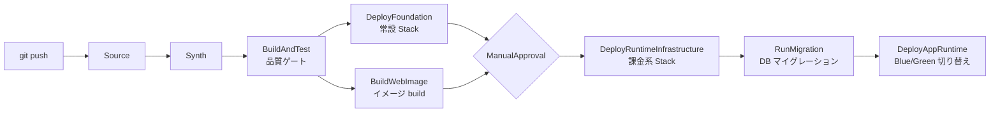
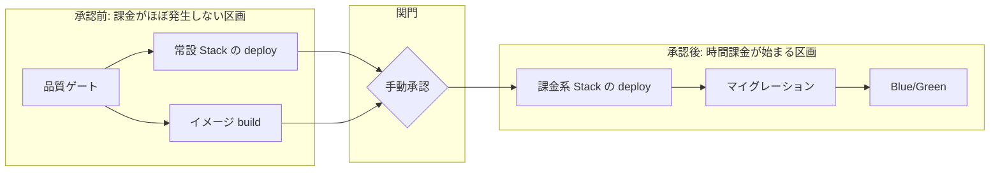
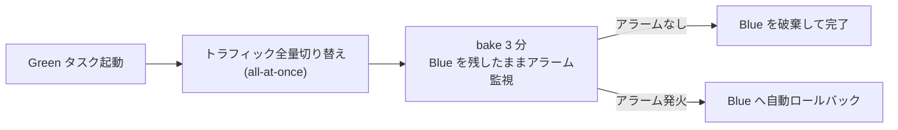
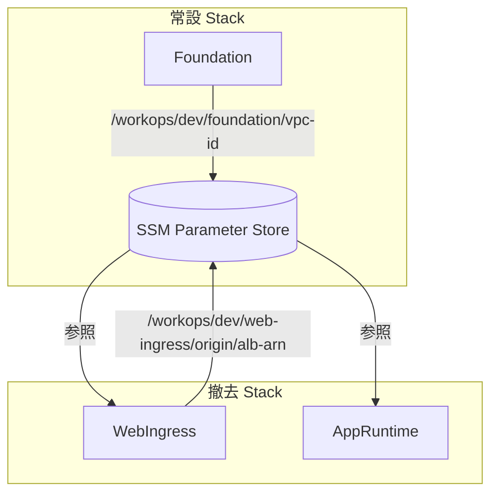
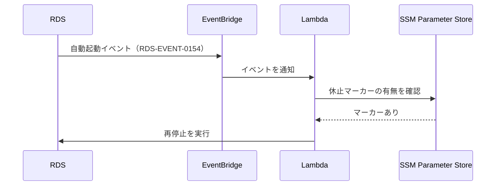
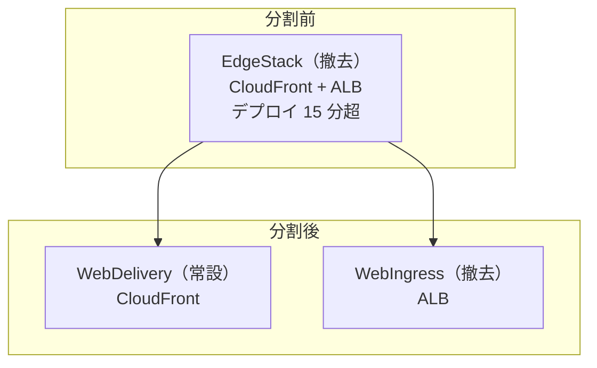

---

title: "6年目エンジニアが、さすがに CI/CD パイプラインをゼロから組んだ"
emoji: "🚚"
type: "tech"
topics:

- aws
- cdk
- codepipeline
- ecs
- cicd
- rds
published: false
published_at: 2026-07-03

---
## はじめに

こんにちは、岩波と申します。

エンジニア 6 年目になりますが、CI/CD パイプラインを自分で組んだことがありませんでした。

業務では常に整備済みのパイプラインの上で開発しており、push すればビルドとデプロイが走る環境を当たり前のものとして使ってきました。

その仕組みは別チームの管理下にあり、私には触る権限がありませんでした。

できたのは、管理者に質問することと、見える範囲を自分で確認することまででした。

そこで、個人の AWS 検証環境 WorkOps に、CI/CD パイプラインをゼロから組みました。

WorkOps は Web サーバー構成を自分で設計するために作った検証環境で、その経緯は[前記事](https://zenn.dev/kyiwanami/articles/web-server-architecture)に書いています。

本記事は単体で読めるように書いており、前記事の知識は前提にしません。

制約は 3 つ置きました。

- AWS ネイティブのサービスだけで完結させる
- デプロイの手前に人間の承認を挟む
- 使っていない時間帯の課金をほぼ 0 円に抑える

この 3 つを同時に満たそうとすると、パイプラインの構造そのものに設計判断が要ります。

本記事はその設計判断を、完成形から順に説明します。

## 組んだもの

完成形のパイプラインは次のとおりです。

図の各ステージ名は実際の [CodePipeline](https://docs.aws.amazon.com/codepipeline/latest/userguide/welcome.html) のステージ名で、リポジトリのコードとそのまま対応します。

[CDK Pipelines](https://docs.aws.amazon.com/cdk/v2/guide/cdk-pipeline.html) は、パイプライン自体を CDK のコードとして定義し、パイプラインが自分自身の定義変更も取り込んで更新する仕組みです。

実装には **CDK Pipelines** を使いました。

アプリケーションとインフラとパイプラインを 1 つのリポジトリのコードで管理できます。

設計の芯は、手動承認を「課金が始まる直前の、唯一の関門」に置いたことです。

承認より前の工程はすべて、実行しても追加課金がほぼ発生しないものだけで構成しています。

承認した瞬間から、ALB や ECS タスクのような時間課金のリソースが立ち上がります。

つまり承認ボタンは「リリースしてよいか」の確認であると同時に、「ここから課金してよいか」の確認でもあります。

### GitHub Actions を組んでから、捨てた

実は前記事の時点では、GitHub Actions と OIDC のデプロイを組んで動かしていました。

その上で [CodePipeline](https://docs.aws.amazon.com/codepipeline/latest/userguide/welcome.html) に乗り換えています。

両方組んで感じた差は次のとおりです。

| 観点 | GitHub Actions | CodePipeline + CDK Pipelines |
| --- | --- | --- |
| 組み始めの速さ | yaml 1 枚で動く | 初回は概念の学習が要る |
| AWS 側の権限管理 | OIDC の信頼ポリシーを別途管理 | パイプラインの role に集約 |
| デプロイ状態の見え方 | AWS の外から結果だけ見える | ステージ単位で AWS 内に揃う |
| パイプライン自体の変更 | yaml を手で編集 | CDK コードとして品質ゲートを通る |

決め手は最後の行です。

インフラをコードで管理するなら、パイプラインだけ手書きの yaml で残す理由がありませんでした。

本記事で扱うのは、この乗り換え後の構成です。

## リリースの流れを辿る

1 回のリリースを、パイプラインの上流から順に辿ります。

全体は「承認前」「承認」「承認後」の 3 区画に分かれます。

### branch 名がそのまま stage 名になる

デプロイ対象の環境（stage）は branch 名で決まります。

`dev` branch への push は dev 環境のパイプラインを起動します。

環境の指定を人間の操作から排除することで、「意図しない環境へのデプロイ」という事故の入り口を塞いでいます。

### 品質ゲートは検出した時点でパイプラインを止める

最初の関所は品質ゲートです。

ここで走る検査はすべて FAIL mode、つまり違反を 1 件でも検出した時点でパイプラインを止める設定にしています。

警告として流す運用にすると、警告は必ず放置されて積み上がるためです。

検査の内訳は次のとおりです。

| 検査 | 対象 | 役割 |
| --- | --- | --- |
| Spotless | Java | コードフォーマットの検査 |
| SpotBugs | Java | バグパターンの静的解析 |
| JaCoCo | Java | テストカバレッジの計測（line 80% 未満で停止） |
| Trivy | コンテナイメージ | 脆弱性スキャン（MEDIUM 以上で停止） |
| ESLint と Prettier | フロントエンド | 静的解析とフォーマットの検査 |

### 承認前に「無料でできること」を全部済ませる

品質ゲートを抜けると、常設 Stack のデプロイとコンテナイメージのビルドが並列で走ります。

どちらも実行しても時間課金のリソースを生まないため、承認前の区画に置けます。

ビルドしたイメージは ECR に push します。

ECR のタグは [immutable](https://docs.aws.amazon.com/AmazonECR/latest/userguide/image-tag-mutability.html)、つまり同じタグ名での上書き push を禁止する設定にし、タグには commit の SHA を使っています。

「同じタグなのに中身が違う」という状態を仕組みで作れなくするためで、保持するのは最新 10 個だけです。

Trivy のスキャンは、この push より前に実行しています。

脆弱性のあるイメージがレジストリに存在する瞬間を、そもそも作らないためです。

### 承認を待つ間、通知は 2 種類しか飛ばない

承認待ちに入ると通知が届きます。

このパイプラインが通知を出すのは「承認待ちになった」と「パイプライン全体が失敗した」の 2 つだけです。

ステージごとの成功通知は出しません。

通知が多いと人間は通知を読まなくなり、本当に読むべき 2 つが埋もれるためです。

### 承認後、課金系リソースが立ち上がり Blue/Green で切り替わる

承認すると、ALB や ECS サービスを含む課金系 Stack がデプロイされます。

続いて DB マイグレーションが走り、最後にアプリケーションが **Blue/Green** で切り替わります。

Blue/Green は、旧タスク群（Blue）を残したまま新タスク群（Green）を立ち上げ、トラフィックの向き先を切り替えるデプロイ方式です。

切り替え中も旧タスクが生きているため、問題があれば向き先を戻すだけで復旧できます。

[ECS ネイティブの Blue/Green 機能](https://docs.aws.amazon.com/AmazonECS/latest/developerguide/deployment-type-blue-green.html)を使い、切り替えは all-at-once、つまりトラフィックを一度に全量切り替える設定にしました。

個人環境では段階的な切り替えを観察する対象ユーザーがいないため、切り替え自体は一気に行い、その代わり切り替え後の監視を厚くしています。

切り替え後には **bake** の時間を 3 分置いています。

bake は、切り替えが済んだ後も旧タスクをすぐには破棄せず、アラームを監視しながら待つ猶予時間です。

この 3 分の間に監視しているアラームは 2 本です。

- HealthyHostCount < 1（健全なタスクが 1 つもない）
- UnHealthyHostCount > 0（不健全なタスクが 1 つでもある）

どちらかが発火すると、旧タスクへ自動でロールバックします。

bake を置く理由は、起動直後は正常に見えて数十秒後に落ちる、という壊れ方をアプリケーションがするためです。

Blue/Green を支える設定値は次のとおりです。

| 設定 | 値 | 意図 |
| --- | --- | --- |
| ヘルスチェック | `/actuator/health` を 30 秒間隔 | Spring Actuator の応答で判定 |
| 起動猶予 | 90 秒 | Spring Boot の起動完了までヘルスチェック失敗を無視 |
| デタッチ待ち | 30 秒 | 切り替え時に処理中のリクエストを流し切る |
| デプロイ中の台数 | min 100% / max 200% | 旧タスクを残したまま新タスクを追加 |
| circuit breaker | rollback 有効 | 起動失敗を繰り返す場合も自動で戻す |

アラームは blue と green 両方のターゲットグループのメトリクスを数式で合算し、どちらの群にいるタスクかに関係なく全体の健全性を見ています。

### push から完走までの実測

時間も計測しました。

1 回目は環境をゼロから立ち上げた初回、2 回目は Web アプリの変更だけを流した日常運転です。

手動承認の待ち時間は除いています。

| 区間 | 初回 | 日常の変更 |
| --- | --- | --- |
| Source からパイプラインの自己更新まで | 約 6 分 | 約 4 分 |
| 品質ゲート | 4 分 07 秒 | 4 分 07 秒 |
| 常設 Stack の deploy | 約 5 分 | 1 分 12 秒 |
| イメージ build とスキャン | 3 分 36 秒 | 3 分 36 秒 |
| 課金系 Stack の deploy | 約 25 分 | 1 分 50 秒 |
| マイグレーションと Blue/Green | 約 6 分 | 約 9 分 |
| 合計 | 約 50 分 | 約 26 分 |

初回と日常で差が出るのは課金系 Stack の deploy です。

初回は CloudFront を含む WebDelivery に 12 分 59 秒、RDS を含む Data に 7 分 51 秒かかりました。

日常の実行ではどちらも作り直さないので、この時間は払っていません。

EdgeStack を分割して CloudFront を常設側へ移した判断（後述）が、ここで効いています。

正直、日常の変更で 26 分は速くないです。

bake の 3 分は監視のために置いた時間なので削りませんが、Synth、パイプラインの自己更新、アセット転送、品質ゲートが直列に並ぶ約 8 分は、コードを 1 行変えただけでも毎回かかります。

パイプライン定義の変更もコードとして品質ゲートを通る、という性質と引き換えの時間です。

1 人で使う分には許容しました。チームで使うなら、まず品質ゲートの並列化から手を付けると思います。

## Stack をライフサイクルで切る

「アイドル時ほぼ 0 円」を成立させている構造がこの章です。

CDK の Stack を、機能ではなくライフサイクルで分類しました。

分類は 3 つです。

| 分類 | 扱い | 該当 Stack |
| --- | --- | --- |
| 常設 | 置いたままでも課金がほぼ 0 円 | Foundation, Logs, Identity, Registry, DataPause, WebAcl, WebDelivery |
| 撤去 | 使い終わったら削除する | Egress, WebIngress, MigrationRunner, AppRuntime |
| 休止 | 削除せず停止する | Data |

時間課金のリソース（NAT、ALB、ECS タスクなど）はすべて撤去分類の Stack に隔離しています。

検証を終えたら撤去分類だけを削除すれば、課金がほぼ 0 円に戻ります。

RDS だけは削除するとデータが消えるため、休止という第 3 の分類を設けました（次章で扱います）。

この分類は CDK Pipelines 上では 3 つの Stage として実装しています。

PermanentStage が常設、RuntimePrereqStage が実行の前提、AppRuntimeStage がアプリケーション本体です。

分類をまたぐ値の受け渡しには **SSM contract** という方式を採りました。

[SSM Parameter Store](https://docs.aws.amazon.com/systems-manager/latest/userguide/systems-manager-parameter-store.html) は名前を付けて値を保存できる AWS のサービスで、contract はそのパラメータ名を Stack 間の取り決めとして固定する、という意味の自作の呼び名です。

[CloudFormation には Export と ImportValue](https://docs.aws.amazon.com/AWSCloudFormation/latest/UserGuide/using-cfn-stack-exports.html) という標準の受け渡し機能がありますが、これを使うと「参照されている Stack は削除できない」という依存関係が生まれます。

撤去分類の Stack を自由に消すという設計方針と衝突するため、SSM パラメータ経由の疎な受け渡しに切り替えました。

値を公開する側と参照する側が互いの存在を知らなくてよいため、片方だけを削除できます。

## RDS を止めたまま維持する仕組み

休止分類の Data Stack には、RDS 特有の問題があります。

[RDS は停止しても 7 日経つと自動で再起動する仕様](https://docs.aws.amazon.com/AmazonRDS/latest/UserGuide/USER_StopInstance.html)で、放置すると気づかないうちに課金が再開します。

これを防ぐために **DataPause** という常設の仕組みを作りました。

RDS は自動起動の際に RDS-EVENT-0154 というイベントを発行します。

EventBridge がこれを拾って Lambda を起動し、Lambda は SSM Parameter Store の休止マーカーを確認します。

マーカーがあれば「これは意図しない自動起動だ」と判断して RDS を再停止し、マーカーがなければ（ParameterNotFound）意図的な起動とみなして何もしません。

「止めたい」という人間の意図を SSM のマーカーとして永続化しておき、AWS 側の自動起動と突き合わせる、という構造です。

CloudTrail のログから起動理由を判定する案も検討しましたが、ログの反映遅延で判定が不安定になるため不採用にしました。

## 組む途中で設計を切り直した箇所

計画どおりに進まなかった箇所を 3 つ書きます。

### EdgeStack をデプロイ時間で分割した

当初、CloudFront と ALB は EdgeStack という 1 つの Stack にまとめていました。

これを撤去分類に置いたところ、デプロイに 15 分 11 秒かかりました。

CloudFront のディストリビューション作成が遅く、撤去と再構築のたびにこの時間を払うことになります。

そこで WebDelivery と WebIngress の 2 つに分割しました。

CloudFront は置いたままでもほぼ課金されないため常設に移し、時間課金される ALB だけを撤去分類に残しました。

分割の基準がここでも機能とコストではなくライフサイクルだった、という点で、前章の分類方針の追認になりました。

なお分割作業では、CloudFront から VPC 内の ALB へ直接つなぐ VpcOrigin という機能の設定で 1 か所引っかかりました。

VpcOriginEndpointConfig の Arn に指定するのは VpcOrigin 自体の ARN ではなく ALB の ARN で、ドキュメントからは読み取りにくい仕様でした。

### DB マイグレーションの実行場所を 3 回変えた

DB マイグレーションには **Flyway** を使っています。

Flyway は SQL ファイルに版番号を付け、どこまで適用済みかを DB 側に記録するマイグレーションツールです。

この Flyway をどこで実行するかは 3 回変わりました。

1 回目はアプリケーションの起動時に実行する構成でした。

Blue/Green と組み合わせると、新旧のタスクが並行する時間帯に新スキーマの適用タイミングを制御できないため、破棄しました。

2 回目は ECS の RunTask、つまりタスクを 1 回だけ単発実行する API でマイグレーション専用コンテナを走らせる案でした。

実行のためだけにコンテナイメージの管理が 1 系統増えるのが重く、これも破棄しました。

最終形は、パイプライン内の CodeBuild から Flyway の CLI を実行する構成です。

マイグレーション定義は `db/pom.xml` という独立した Maven project に切り出したため、手元からも `cd db; mvn -Pdev flyway:migrate` の 2 コマンドで同じマイグレーションを実行できます。

パイプラインと手元で実行経路が同じになったことが、この形を最終形と判断した決め手でした。

この切り出しには、将来の構想に対する意味もあります。

WorkOps では、外部提供 API を `apps/api`、重いバッチ処理を `apps/batch` として、Web とは別のアプリに分ける構想を後続フェーズに置いています。

マイグレーションが `apps/web` の起動責務のままだと、DB スキーマの正本が Web アプリ 1 つに紐づき、api や batch が同じ DB を使い始めた時点で、スキーマを誰が管理するのかが崩れます。

`db/` への切り出しは、マイグレーションを特定アプリの持ち物ではなく、DB そのもののライフサイクル責務として扱う宣言でもあります。

アプリが何個に増えても、DB スキーマの正本は `db/` の 1 か所のままです。

副産物として、この過程でビルドとランタイムのアーキテクチャを ARM_64 に統一しました。

実行基盤を AWS 製の ARM プロセッサである Graviton に寄せることで、ビルド環境と実行環境の差異による不具合の可能性を消しています。

### 依存パッケージの取得経路を CodeArtifact に一本化した

ビルド中の依存取得は、Maven Central と npm registry への直接アクセスをやめ、AWS のパッケージリポジトリサービスである [CodeArtifact](https://docs.aws.amazon.com/codeartifact/latest/ug/welcome.html) 経由に一本化しました。

外部レジストリの障害や改ざんの影響をプロキシで一段遮断するためです。

このとき認証情報の扱いに 1 点工夫が要りました。

CodeArtifact の認証トークンをコンテナイメージのビルドに渡す際、通常の引数で渡すとイメージのレイヤーに残ります。

そこで [BuildKit secret](https://docs.docker.com/build/building/secrets/)、つまりビルド中だけ一時的にファイルとして値を渡し、完成したイメージには痕跡を残さない Docker の仕組みを使いました。

また、依存取得のダウンロード通信が NAT を経由すると通信量課金が発生します。

S3 への通信だけは Gateway 型エンドポイント、つまり NAT を経由せず VPC 内から S3 へ直接到達する無料の経路に逃がし、NAT の通過量を抑えました。

## 初回完走までに詰まった箇所

パイプラインは一発では完走しませんでした。

作業ミスの類いは省いて、この構成を選んだ人が同じように踏むはずの衝突を 3 つ書きます。

### 自分を直す修正が、自分を通れない

CDK Pipelines の self-mutation は、パイプライン定義の変更を Synth → SelfMutate の順で自分自身に取り込みます。

初回の実走では、この Synth が落ちました。CodeBuild の Node.js が古いままで、依存が要求するバージョンに届かず、npm の lock file 検証も通らない状態です。

ここで構造的な詰みに気づきました。Node.js を上げる修正を push しても、その修正をパイプラインに反映する SelfMutate は、壊れている Synth の後ろにいます。

壊れているのが Synth 自身だと、直す変更がパイプラインを通れません。

脱出方法は、ローカルから PipelineStack を直接 deploy して、Synth の CodeBuild 定義を先に更新することでした。

通常運用はパイプライン経由に一本化していますが、パイプライン自身が壊れたときのためのローカル deploy 経路は、退路として手順に残しています。

### Docker Hub の rate limit を 2 回踏んだ

依存取得は CodeArtifact に一本化したはずでした。それでも build が落ちました。

1 回目は Dockerfile の base image です。eclipse-temurin を Docker Hub から匿名 pull していて、rate limit に当たりました。

CodeBuild は毎回まっさらなホストで走るため、手元では効いていた pull キャッシュが存在しません。

base image は Amazon ECR Public の Amazon Corretto と Amazon Linux 2023 minimal に替えました。

2 回目は品質ゲートの中でした。統合テストの Testcontainers が、MySQL 8.4 の image をやはり Docker Hub から pull していました。

こちらは ECR Public のミラーを代替 image に指定し、Testcontainers が後始末用に起動する Ryuk コンテナも Docker Hub 由来なので無効化しました。

Maven と npm だけ見て依存経路を塞いだつもりでしたが、コンテナイメージも依存です。取得経路の棚卸しから丸ごと漏れていました。

### SSM contract は region を跨げない

CloudFront 用の WAF は us-east-1 に作る、という AWS 側の制約があります。

そこで WAF の ARN も他の値と同じように SSM contract で公開したところ、東京リージョン側の WebDelivery の deploy が、parameter が見つからず落ちました。

SSM Parameter Store は region 内の仕組みで、us-east-1 に書いた値は東京からは見えません。

この 1 値だけは SSM をやめ、CDK の cross-region reference で渡しました。

Stack 間の値の受け渡しを SSM contract に揃えるという方針の、唯一の例外が region 境界で生まれた形です。

## WAF とセキュリティメトリクス

パイプラインの流れとは別に、この構成で足したセキュリティまわりを 2 つ書きます。

### WAF は us-east-1 という制約ごと組み込んだ

CloudFront に WAF を付ける場合、WebACL は us-east-1 に作る必要があります。

そこで WebAcl だけ独立した Stack にし、CDK の cross-region reference で ARN を東京リージョン側の CloudFront に渡しています。

ルールは AWS Managed Rules の Common Rule Set を Count mode で有効化しました。

ログは `aws-waf-logs-` という prefix が必須という命名制約に従った LogGroup に、1 週間だけ保持しています。

### 認証・認可の失敗はメトリクスとして数えている

アプリケーションは認可拒否やユーザー突合の失敗を構造化ログとして出しています。

これを CloudWatch Logs の metric filter 6 本で拾い、WorkOps/Security という名前空間のメトリクスに変換しています。

対象は認可拒否、Cognito ユーザーと DB ユーザーの突合失敗、actor type の不整合、権限セットの未割り当てなどです。

アラームとダッシュボードはあえて付けず、攻撃や設定ミスの痕跡を後から数えられる状態だけを作りました。

## 個人検証環境として削った判断

作らなかったものも書いておきます。

いずれも「業務なら作るが、この環境の目的には過剰」と判断したものです。

- 数値の SLO。監視対象のユーザーがいないため、アラーム 2 本の構成で足りると判断しました
- staging と prod の分離。環境は branch で増やせる構造にしてあり、常設はしていません
- KMS の CMK（自分で管理する暗号鍵）。AWS 管理鍵との差分が鍵の管理コストに見合いませんでした
- WAF の Block mode。ルールは Count mode、つまり検出だけ行い遮断しない設定で有効化し、誤遮断の調査コストを避けました
- メトリクスのダッシュボード。見る習慣が生まれる規模ではないため、アラーム駆動に寄せました
- パイプライン role の細分化。CDK Pipelines の self-mutation は、パイプライン自身が自分の定義を更新できる構成で、パイプラインの role が事実上インフラ全体の変更権限を持ちます。業務ならデプロイ role の分離と承認境界の設計が必須ですが、単一アカウントの個人環境では、GitHub 側の branch 保護を実質の境界として許容しました

削る判断にも根拠を書き残す、というのはこのポートフォリオ全体で通している方針です。

## ソースコード

構成はすべて次のリポジトリにあります。

@[card](https://github.com/kyiwanami/workops)

## おわりに

ここまで、任せきりだった CI/CD を自分で組んでみたことで、push から Blue/Green までの流れを自分で組み立てられるようになりました。

組んでみて分かったのは、業務で使ってきたパイプラインの構成が、どれも誰かの設計判断の結果だったということです。

品質ゲートの位置、承認の位置、ロールバックの条件。

使う側だったときは仕様として受け入れていたものが、いまは判断の履歴として読めます。

次に業務でパイプラインの管理側と話すとき、話せる内容が変わっているはずです。

一方で、監視と障害対応、DB のバックアップとリストアのような運用の領域は、まだ任せきりのままです。

次はここを、自分の設計判断で語れる領域にしていきます。
