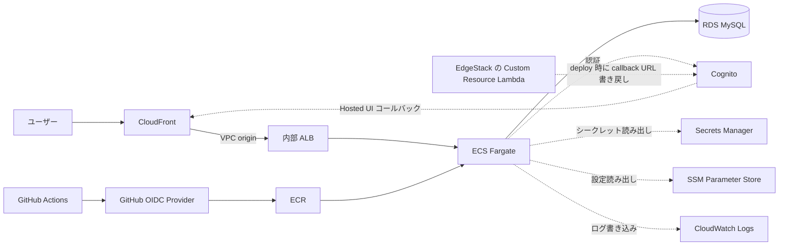
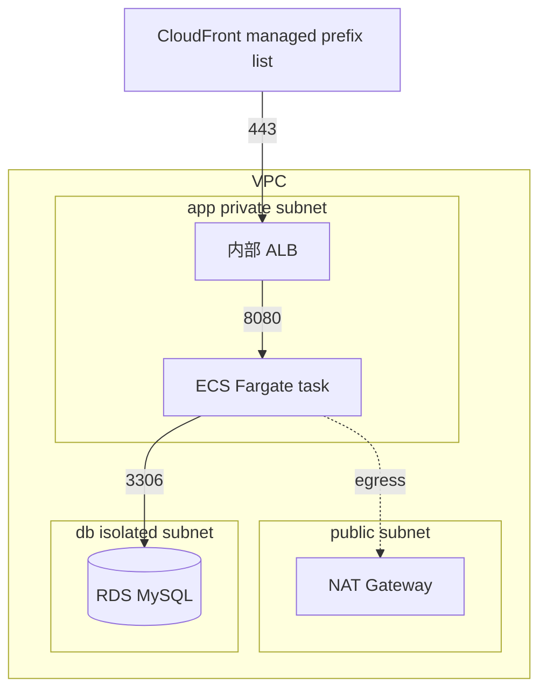
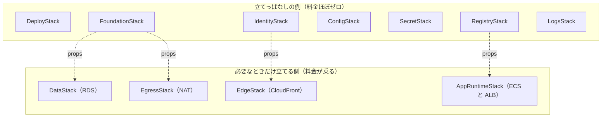
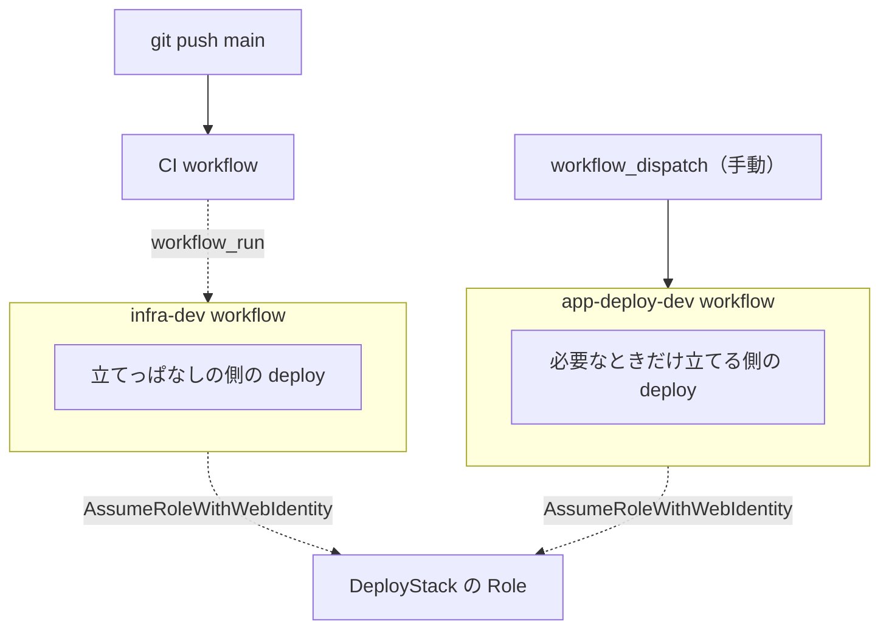

## いま Web サーバー構成をゼロから組んだ動機

こんにちは。岩波と申します。

私は新卒エンジニア 6 年目になりますが、自分で Web サーバー構成を組んだことがありませんでした。

最初の 4 年半は、ECS Fargate 上の Spring Boot アプリ、Lambda、Step Functions、SQS といった AWS マネージドサービス上のワークロード設計と実装を続けてきました。

その部署異動し、2年ほどAWS Amplifyで主にCognito、AppSync、Lambda、DynamoDB の組み合わせ用いたWEBサービスを扱うようになりました。

ただ、最近気づいたこととして、

- 業界ではこの Web サーバー型がスタンダードであり、Amplifyのようなサーバーレスが出た現在も尚主流
- AWS資格でもサーバー型のケースが多い
- これまで触ってきたのはアプリ層と AWS マネージドのワークロードだけで、その下の VPC、Subnet、Security Group、ALB、RDS は別チームから整えられた状態で渡ってきていた

そこで、さすがにAWSの主要技術を触っていないのはまずいと感じ、自分用に Web サーバー構成を一度ゼロから組むことにしました。

VPC を 3 層に分けて、Security Group の ingress を連鎖させて、CloudFront から ALB、ECS、RDS まで経路を通すところまで、自分で書きました。Amplify と AWS マネージドサービス、そして別チームに任せていた範囲を、自分で組み立てるところまで来ました。

## 組んだもの

<aside>
📷

ここに画面キャプチャを 1〜2 枚入れます（あとで差し込み予定）

</aside>

申請、資産、会社、部署、ユーザーを管理するマルチテナント業務管理 Web アプリの MVP を、Spring Boot と Thymeleaf で書きました。

主な機能は次のとおりです。

- マルチテナント分離（会社境界、`company_id` で他社データの参照と更新を遮断）
- Cognito の App Client 分離（PLATFORM 用と TENANT 用）
- ロール認可（PLATFORM_ADMIN、TENANT_MANAGER、TENANT_EDITOR、TENANT_VIEWER）
- 申請管理（下書き、提出、承認、却下、差戻し）
- 資産管理と会社別マスタ管理

ソースは https://github.com/kyiwanami/workops に置いています。

ここからは、このアプリを動かす AWS の Web サーバー構成と、組む途中でハマった箇所を残します。

## リクエスト経路で見る全体構成

ユーザーから RDS までの本流が CloudFront → 内部 ALB → ECS Fargate → RDS MySQL です。

そこから脇に Cognito、Secrets Manager、SSM、CloudWatch Logs、ECR と GitHub Actions が伸びています。

構成自体に特殊な要素はありません。

ただ、自分でこの構成を 1 から組んだのは今回が初めてです。

生身のネットワークと、生身のコンテナと、生身のリレーショナルデータベースが、CloudFront の後ろに並んでいるだけです。

## CloudFront から RDS まで、リクエスト経路を辿る

この章では、ユーザーのリクエストが CloudFront から RDS まで届く経路を順に追います。

CloudFront を入口に置いた判断そのものは別の章にまとめたので、ここでは経路の話に絞ります。

Viewer から CloudFront までは HTTPS、CloudFront から内部 ALB と、ALB から ECS task までは HTTP です。

CloudFront 側の設定は caching disabled、origin request policy は `ALL_VIEWER_EXCEPT_HOST_HEADER` を選んでいます。

VPC を 3 層の subnet に分けています。

- public subnet：NAT Gateway を置いて、app private subnet からの egress（ECR image pull、CloudWatch Logs）を出している
- app private subnet：ECS Fargate task と内部 ALB
- db isolated subnet：RDS MySQL

Security Group の ingress は CloudFront の managed prefix list → ALB → ECS task → RDS の順で連鎖させています。

自分は CloudFront が ingress の起点になるという意識をこれまで一度も持ったことがなかったので、ALB の SG inbound に CloudFront の managed prefix list を入れる部分で一度止まりました。最初は ALB の inbound 設定なしで CloudFront から流したところ、504 が返ってきました。prefix list ID を `pl-...` で固定せず、`com.amazonaws.global.cloudfront.origin-facing` の名前で CDK lookup させて inbound に入れたら通りました。

ECS task の image は ECR から pull します。

ECS task が必要とする設定値は、性質ごとに置き場所を分けました。`SPRING_PROFILES_ACTIVE` と JDBC URL は SSM Parameter Store に置き、DB の username と password は Secrets Manager（RDS が自動生成したもの）から、Cognito の URL と Client ID は CDK 上で env として直接渡しています。

個人で動かす検証環境なので、サイズは最小にしました。

- RDS：`db.t4g.micro`
- ECS task：0.5 vCPU / 1 GB
- ECR image retention：2 世代
- CloudWatch Logs retention：7 日

これで開発期間 2 週間のあいだ AWS 料金は合計 5 ドル程度に収まりました。

## CDK Stack を、立てっぱなしの側と必要なときだけ立てる側に分ける

5 ドルで済んだのは、CDK Stack を「立てっぱなしの側」と「必要なときだけ立てる側」に最初から分けたからです。

アプリを触らない時間帯は、料金が乗る部分だけ destroy で消せるようにしておきたかったので、Stack の境界をその基準で切りました。

立てっぱなしの側は VPC、IAM の OIDC、SSM、Secrets Manager、ECR、CloudWatch Logs、Cognito です。

これらは存在しているだけでは料金がほぼ発生しません（厳密には Secrets Manager の secret 数や ECR の image 容量で多少出ますが、ほぼ無視できる額です）。

立てっぱなしにしておくと確認サイクルが速く、毎回作り直すと OIDC Provider や Cognito User Pool の sub が変わって設定が崩れるので、これらは触らない側に寄せました。

必要なときだけ立てる側は RDS、NAT、CloudFront、ECS、ALB です。

動作確認したいときだけ deploy して、確認が終わったら destroy する運用にしています。

deploy は `app-deploy-dev` workflow を手動 dispatch して、`confirm_runtime_deploy` を true にして起動します。workflow は DataStack、EgressStack、EdgeStack、AppRuntimeStack を順に deploy したあと、ECS service stable を待ち、CloudFront 経由で `/actuator/health` が 200 を返すまで 10 回までリトライして確認します。destroy は手元から逆順に流します。

RDS（DataStack）も必要なときだけ立てる側に置いている点は、最初は迷いました。普通に考えると RDS はデータが乗るので残したくなりますが、立てっぱなし側に置くと月額がそのぶん乗り続けます。WorkOps の AWS dev は確認データを永続させる目的の DB ではないと割り切り、Flyway migration V1 〜 V8 と `db/seed/aws-dev` の seed で毎回ゼロから再構築する設計にしました。`db/seed/aws-dev` の `V6__insert_users.sql` は `cognito_sub` を NULL で seed しておき、実際の Cognito 連携時に WorkOps の管理導線から `AdminCreateUser` で書き戻します。これで DataStack も destroy 対象に置けて、立てっぱなし側の月額をほぼゼロに保てています。

CDK の entrypoint は単一の `bin/cdk.ts` で全 Stack を定義しています。立てっぱなし／必要なときだけの境界は、GitHub Actions の workflow 側で deploy 対象 Stack を明示することで実現しています。

- `infra-dev` workflow：FoundationStack、SecretStack、ConfigStack、IdentityStack、RegistryStack、LogsStack を deploy（CI 後に自動）
- `app-deploy-dev` workflow：DataStack、EgressStack、EdgeStack、AppRuntimeStack を deploy（手動 dispatch）
- GitHub Actions OIDC の Role を持つ DeployStack だけは最初の 1 回、手元から deploy しています

SG の本体は FoundationStack に置きましたが、ingress rule は通信要件を持つ Stack の側に寄せました。CloudFront prefix list から ALB SG への HTTP 80 許可は EdgeStack、ALB SG から ECS task SG への 8080 許可は AppRuntimeStack の `CfnSecurityGroupIngress`、ECS task SG から DB SG への 3306 許可は DataStack。Stack 分離の境界と SG 通信要件の境界を一致させると、必要なときだけ立てる側を destroy しても、立てっぱなし側の SG に runtime 通信用の inbound rule が残らずに済みます。

ここから、Stack 分離を入れたからこそ出会ったハマりが 2 件あります。

### Custom Resource Provider が暗黙に作る LogGroup の残骸

CDK で Custom Resource を書くと、内側で Lambda Provider が動いて、その Lambda が CloudWatch Logs に LogGroup を作ります。

この LogGroup は Custom Resource の Stack に紐づいて作られるはずなのですが、Stack を destroy しても LogGroup が消えませんでした。

`RemovalPolicy.DESTROY` を立てている認識だったので、消えると思っていました。

調べると、Provider が暗黙に作る LogGroup は CDK の `RemovalPolicy` 経路に乗っていないようでした。

LogGroup を Provider と同じ Stack 内で明示的に作って、Provider に `logGroup` で渡す形に直したら、Stack の destroy で LogGroup も一緒に消えるようになり、残骸が増えなくなりました。LogGroup は Provider 用と、Custom Resource の実体である Lambda 用の 2 つを別々に作って、それぞれの construct に渡しています。

### Stack 間参照を `ImportValue` でやると壊せない

Stack 間で値を渡すと、CDK は標準では `Fn::ImportValue` を使います。

これだと、参照されている側の Stack を消そうとした時点で「他の Stack が export を使っている」と怒られて destroy できません。

必要なときだけ立てる側の Stack を destroy するたびに引っかかりました。

`defaultCrossStackReferences: weak` を立てたうえで、依存値は props で渡し、CloudFormation 側では `Fn::GetStackOutput` で読む形に変えて抜けました。

ImportValue を経由しなくなったので、destroy 時の引っ張りが消えました。

## 個人検証環境で削った構成判断

開発期間 2 週間で AWS 料金が合計 5 ドル程度に収まったのは、個人検証環境という前提を理由に、本番なら入れる構成要素を最初から削ったからでした。

削った項目を、本番に戻す想定とあわせて並べます。

- **RDS の Multi-AZ**：DataStack の MySQL は singleAZ、`db.t4g.micro`、20 GB gp2 です。検証データを毎回 Flyway で作り直す前提なので冗長性を捨てました。本番では Multi-AZ にするか、Aurora Serverless v2 に置き換えます。
- **独自ドメインと ACM 証明書、Route 53**：取りません。CloudFront default domain がそのまま HTTPS 入口になるので、ドメイン取得と DNS 設定、ACM 発行の経路を丸ごと省きました。
- **WAF**：CloudFront の前段に WAF を挟んでいません。攻撃面を持たない検証環境なので入れていません。独自ドメイン化と一緒に、AWS WAF をマネージドルールで紐付けます。
- **NAT Gateway の冗長化**：EgressStack の NAT は 1 つだけで、public subnet[0] にしか置いていません。app private subnet が 2 AZ にあるので、片方の AZ がダウンしたときは ECR からの image pull が落ちます。本格運用では各 AZ に 1 つずつ置きます。
- **ALB の HTTPS listener**：内部 ALB は HTTP 80 だけで listener を持っています。CloudFront → 内部 ALB の VPC origin が HTTP なので、ALB に証明書を入れていません。
- **ECS Service の Auto Scaling**：desiredCount は 1 固定です。検証中に同時アクセスが増える状況がないので、1 task で十分です。
- **CloudWatch Logs と ECR の保持期間**：Logs retention は 7 日、ECR の tagged image は 2 世代、untagged は 1 日で削除しています。

これらは「立てっぱなしの側」と「必要なときだけ立てる側」の Stack 分離方針と組み合わさって、立てっぱなしの側はほぼ料金がかからない構成になりました。

立てっぱなしの側に残る IAM Role、Cognito User Pool、SSM Parameter Store、Secrets Manager、ECR、CloudWatch LogGroup は、いずれもアイドル時の課金がほぼゼロです。

secret の本数が少なく、ECR の image 容量も小さく、Cognito の MAU も検証中はゼロに近いので、立てっぱなしでも月額の見えるラインに乗りません。

2 週間で 5 ドル、の内訳は、必要なときだけ立てる側を deploy していた時間に NAT Gateway と RDS と ECS task と ALB が乗っていた分、と整理できます。

## CloudFront を CDN 入口に置いた選択

CloudFront を入口に置いた理由は 1 つではありません。

入口の形は CDN に揃えることにしました。

業界一般の Web サーバー構成では、CDN として CloudFront を入口に置くのが標準的な並びです。

配信負荷分散や Edge キャッシュを今は使わない検証構成でも、入口の形だけ標準に揃えておくと、後段に WAF を挟む、Origin Shield を有効にする、別 origin を追加する、Lambda@Edge を入れる、といった拡張がそのまま選択肢に乗ります。

HTTPS 入口は CloudFront default domain でそのまま成立します。

CloudFront の default domain は `*.cloudfront.net` の形で、ACM 証明書を別途用意しなくても CloudFront 側で HTTPS が立ちます。

独自ドメインを取らない個人検証環境では、この default domain がそのまま入口になりました。

ACM 発行と Route 53 の設定、ALB の HTTPS listener と証明書差し替えを丸ごと省けました。

internal ALB を public に出さずに済むのも、CloudFront を入口に置いた効果でした。

CloudFront には VPC origin の機能があり、CloudFront から直接 private subnet の内部 ALB に到達できます。

これがあるので、ALB を public に出さずに app private subnet に閉じたまま外からのリクエストを受けられます。

ALB を public にした構成と比べて、ALB の SG inbound に CloudFront prefix list だけを許可する形にできて、ALB がインターネットに直接さらされません。

CloudFront を入口にした副作用として、Cognito Hosted UI の戻り先周りで詰まった箇所が 2 つあります。

### Cognito callback URL と CloudFront ドメインの循環依存

Cognito の App Client の callback URL に CloudFront のドメインを入れたいのに、その CloudFront 側の deploy には Cognito の Hosted UI URL が要る、という循環依存が発生しました。

CloudFront のドメインは Distribution が deploy された時点でないと確定しません。

Cognito 側で先に callback URL を確定させたくても、CloudFront を deploy するまでは入れる文字列がない、という状態です。

最初は placeholder の callback URL（`https://example.com/` のようなダミー）で Cognito を deploy しておき、CloudFront の deploy 後に EdgeStack の Custom Resource で実際の CloudFront ドメインを書き戻す、という二段にして抜けました。

書き戻す側は EdgeStack 内の Custom Resource Lambda で、`UpdateUserPoolClient` API を呼び出します。

PLATFORM 用と TENANT 用の 2 つの App Client に対して、それぞれ `https://<distribution-domain>/login/oauth2/code/platform`、`/login/oauth2/code/tenant` の URL を組み立てて書き込んでいます。

Custom Resource は Create と Update のときだけ書き戻して、Delete のときは何もしません。

EdgeStack を destroy するときに callback URL をまた placeholder に戻してしまうと、次に EdgeStack を立て直すまでのあいだ Cognito の Hosted UI が壊れた状態で残るので、Delete では最後に書き込んだ URL をそのまま残す形にしました。

### Cognito から戻ると URL が ALB の内部 DNS 名になる

Cognito Hosted UI でログインしたあと、リダイレクトされた先のページから次のページに遷移しようとすると、絶対 URL が ALB の内部 DNS 名になっていて、ブラウザから到達できませんでした。

原因は、Spring Security が OAuth2 ログイン後のリダイレクトで絶対 URL を返していて、その絶対 URL の host が Request の Host ヘッダではなく ALB の内部 DNS 名から組み立てられていたためでした。

CloudFront → 内部 ALB の VPC origin は HTTPS から HTTP に降りるので、`X-Forwarded-Proto` と `X-Forwarded-Host` の扱いが絡みます。

Spring Boot 側で `server.tomcat.use-relative-redirects=true` を立てて、絶対 URL ではなく相対 URL を返すようにしたら抜けました。

relative にすると host を組み立てる必要がなくなるので、Host ヘッダの違いが結果に出ません。

## その他、組む途中でハマったこと

### private subnet にいる RDS の中身をどう見るか

RDS は db isolated subnet に置いていて、手元の MySQL クライアントから直接は届きません。EC2 踏み台を立てるか、SSM port forwarding を経由するか、いくつかやり方を見たうえで、今回は AWS Console の RDS 画面に出る「CloudShell VPC environment で接続」を使うことにしました。RDS Console から CloudShell VPC environment を起動すると、VPC 内に CloudShell 用の ENI が建ち、そこに `mysql` クライアントが入った環境で `USE workops;` まで通せました。DataStack 側に CloudShell VPC environment 専用の SG を別途用意して、self-referencing で MySQL 3306 を通したうえで RDS にぶら下げています。確認が終わったら CloudShell VPC environment は削除します。

## これから足したい部分

個人検証環境として削った構成判断は前の章にまとめました。

ここでは、構成そのもの以外で残しているものを並べます。

- 本番相当の運用監視（CloudWatch Alarm の整備、SNS 通知）
- バックアップとリストア手順の検証

## おわりに

ここまで、触ってこなかった範囲を自分で書いてみたことで、自分で組み立てられるようになりました。

ところで、今回の開発は AI をフル活用しました。コーディングはすべてコーディングエージェントに任せていて、自分では 1 行も書いていません。

要件、基本設計、ADR、実装計画は Notion 上で Notion AI と壁打ちして固め、確定したものをコーディングエージェントに渡して実装させる、という進め方です。

コードと設定の最終レビューと採否の判断は、自分で行うようにしました。

この開発手法そのものについては、別記事で改めて書こうと思います。
